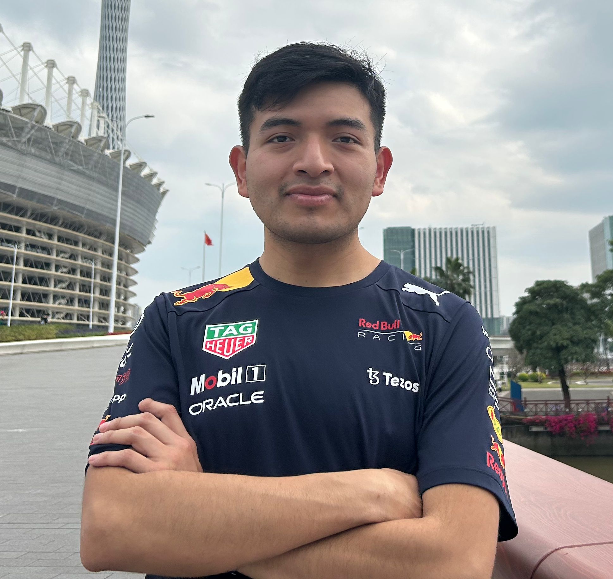

# Evaluating Deep Reinforcement Learning for Asset Management in the Crypto Market

<!-- Improved compatibility of back to top link: See: https://github.com/othneildrew/Best-README-Template/pull/73 -->
<a name="readme-top"></a>
<!--
*** Thanks for checking out the Best-README-Template. If you have a suggestion
*** that would make this better, please fork the repo and create a pull request
*** or simply open an issue with the tag "enhancement".
*** Don't forget to give the project a star!
*** Thanks again! Now go create something AMAZING! :D
-->


<!-- PROJECT SHIELDS -->
<!--
*** I'm using markdown "reference style" links for readability.
*** Reference links are enclosed in brackets [ ] instead of parentheses ( ).
*** See the bottom of this document for the declaration of the reference variables
*** for contributors-url, forks-url, etc. This is an optional, concise syntax you may use.
*** https://www.markdownguide.org/basic-syntax/#reference-style-links
-->
[![Contributors][contributors-shield]][contributors-url]
[![Forks][forks-shield]][forks-url]
[![Stargazers][stars-shield]][stars-url]
[![Issues][issues-shield]][issues-url]
[![MIT License][license-shield]][license-url]
[![LinkedIn][linkedin-shield]][linkedin-url]


<!-- PROJECT LOGO -->
<br />
<div align="center">
  <a href="https://github.com/cs582/SignatureWorkReinforcementLearning">
    
  </a>

<h3 align="center">Evaluating Deep Reinforcement Learning for Asset Management in the Crypto Market</h3>

  <p align="center">
    This project evaluates two different deep learning models for Asset Management using Reinforcement Learning, namely Convolutional Neural Networks (CNNs) and Vision Transformers (ViT).
  </p>
</div>


<!-- TABLE OF CONTENTS -->
<details>
  <summary>Table of Contents</summary>
  <ol>
    <li>
      <a href="#about-the-project">About The Project</a>
      <ul>
        <li><a href="#built-with">Built With</a></li>
      </ul>
    </li>
    <li>
      <a href="#getting-started">Getting Started</a>
      <ul>
        <li><a href="#prerequisites">Prerequisites</a></li>
        <li><a href="#installation">Installation</a></li>
      </ul>
    </li>
    <li><a href="#usage">Usage</a></li>
    <li><a href="#about">About the Author</a></li>
    <li><a href="#contact">Contact</a></li>
    <li><a href="#acknowledgments">Acknowledgments</a></li>
  </ol>
</details>


<!-- ABOUT THE PROJECT -->
## About The Project

[![Product Name Screen Shot][product-screenshot]](https://example.com)

This project is built in partial fulfilment of the Bachelor of Science in Data Science at Duke Kunshan University.

Inspired by the two AlphaFold papers by DeepMind. I decided to tackle the problem of Asset Management using Deep Reinforcement Learning. I test using two different models to handle the task and two different inputs or observations x.

Therefore, I test 4 different approaches to handle the task of Deep Reinforcement Learning for Asset Management.

1. Approach A. Vision Transformers taking a snapshot of the last 24 hourly close prices.
2. Approach B. Convolutional Neural Networks taking a covariance matrix using hourly data from the last 24 hours.
3. Approach C. Convolutional Neural Networks taking a snapshot of the last 24 hourly close prices.
4. Approach D. Vision Transformers taking a covariance matrix using hourly data from the last 24 hours.

The raw data consists of 1000 datapoints, from which the first 24 are used for calculations of the input and hence lost. Then, of the 976 remaining hours, 75% are used (732 datapoints) are used for training and the rest (244 datapoints) are used for evaluation.

<p align="right">(<a href="#readme-top">back to top</a>)</p>


### Built With

[](https://www.python.org/)
[](https://pytorch.org/)
[](https://scikit-learn.org/)
[](https://matplotlib.org/)
[](https://pandas.pydata.org/)
[](https://numpy.org/)

<p align="right">(<a href="#readme-top">back to top</a>)</p>


<!-- GETTING STARTED -->
## Getting Started

Tp get started in this project, you will need to install the required libraries and dependencies.

### Installation

1. Clone the repo
   ```sh
   git clone https://github.com/cs582/SignatureWorkReinforcementLearning.git
   ```
2. Install Requirements
   ```sh
   pip install -f requirements.txt
   ```

<p align="right">(<a href="#readme-top">back to top</a>)</p>


<!-- USAGE EXAMPLES -->
## Usage

There are two main files, the training loop and the evaluation loop. The training loop takes several arguments to play around with. However, most of the values are set as default except for ```-r``` (reward metric), ```-lb``` (lookback window i.e. number of hours to consider when making an observation), ```-algorithm``` (whether to use DQN or Double DQN), ```-model``` (whether to use CNN or ViT), ```-use``` (2 to use a snapshot and 3 to use the covariance matrix), ```-episodes``` (number of training episodes).

1. Training
   ```sh
   # Approach A
   python main.py -r "sharpe" -lb 24 -algorithm "Single_DQN" -model "ViT" -use 3 -episodes 50 2>log.txt
   
   # Approach B
   python main.py -r "sharpe" -lb 24 -algorithm "Single_DQN" -model "CNN" -use 2 -episodes 50 2>log.txt
   
   # Approach C
   python main.py -r "sharpe" -lb 24 -algorithm "Single_DQN" -model "ViT" -use 2 -episodes 50 2>log.txt
   
   # Approach D
   python main.py -r "sharpe" -lb 24 -algorithm "Single_DQN" -model "CNN" -use 3 -episodes 50 2>log.txt
   ```

2. Evaluation
   ```sh
   # Approach A
   python eval.py -r "sharpe" -lb 24 -algorithm "Single_DQN" -model "ViT" -use 3 -episodes 50 -path "models/saved_models/Single_DQN_ViT_29_2023-03-03_19:19:36.pt" 2>log.txt
   
   # Approach B
   python eval.py -r "sharpe" -lb 24 -algorithm "Single_DQN" -model "CNN" -use 2 -episodes 50 -path "models/saved_models/Single_DQN_CNN_29_2023-03-03_21:15:35.pt" 2>log.txt
   
   # Approach C
   python eval.py -r "sharpe" -lb 24 -algorithm "Single_DQN" -model "ViT" -use 2 -episodes 50 -path "models/saved_models/Single_DQN_ViT_29_2023-03-03_18:55:00.pt" 2>log.txt
   
   # Approach D
   python eval.py -r "sharpe" -lb 24 -algorithm "Single_DQN" -model "CNN" -use 3 -episodes 50 -path "models/saved_models/Single_DQN_CNN_29_2023-03-03_20:14:42.pt" 2>log.txt
   ```

<p align="right">(<a href="#readme-top">back to top</a>)</p>

<!-- ABOUT THE AUTHOR -->
## About the Author

<!-- HEADSHOT -->
<br />
<div align="center">
  <a href="https://github.com/cs582/SignatureWorkReinforcementLearning">
    
  </a>

<h3 align="center">Carlos Gustavo Salas Flores</h3>

   <p align="center">
       Carlos Gustavo Salas Flores is a senior undergraduate student at Duke Kunshan University majoring in Data Science. He has been an active member of the university by engaging in competitive activities such as the Alibaba GET Challenge where his team and him finished in the top 10 of 250+ teams across China.
   </p>
   <p align="center">
       He is also a trained Software Engineer and Data Scientist. His team and him participated at Hack Duke 2022 where they got 2nd place for their project "Resume Blinder" which is a Website that uses GPT-3 to hide gender/race related information from job applicants and also show other relevant information about the candidate that may have not been highlighted by the applicant.
     </p>
   <p align="center">
       Last summer, he interned at Amazon.com remotely from Durham, NC at the AWS Lambda team as a Software Engineer/Data Science Intern and is also going back as a Full-time Software Developer Engineer in Seattle.
     </p>
</div>

## Contact Information

Carlos Gustavo Salas Flores - yuseicarlos2560@gmail.com - cs582@duke.edu

Project Link: [https://github.com/cs582/SignatureWorkReinforcementLearning](https://github.com/cs582/SignatureWorkReinforcementLearning)

<p align="right">(<a href="#readme-top">back to top</a>)</p>


<!-- ACKNOWLEDGMENTS -->
## Acknowledgments

* Advisor: Luyao Zhang Ph.D. []()

<p align="right">(<a href="#readme-top">back to top</a>)</p>


<!-- MARKDOWN LINKS & IMAGES -->
<!-- https://www.markdownguide.org/basic-syntax/#reference-style-links -->
[contributors-shield]: https://img.shields.io/github/contributors/cs582/SignatureWorkReinforcementLearning.svg?style=for-the-badge
[contributors-url]: https://github.com/cs582/SignatureWorkReinforcementLearning/graphs/contributors
[forks-shield]: https://img.shields.io/github/forks/cs582/SignatureWorkReinforcementLearning.svg?style=for-the-badge
[forks-url]: https://github.com/cs582/SignatureWorkReinforcementLearning/network/members
[stars-shield]: https://img.shields.io/github/stars/cs582/SignatureWorkReinforcementLearning.svg?style=for-the-badge
[stars-url]: https://github.com/cs582/SignatureWorkReinforcementLearning/stargazers
[issues-shield]: https://img.shields.io/github/issues/cs582/SignatureWorkReinforcementLearning.svg?style=for-the-badge
[issues-url]: https://github.com/cs582/SignatureWorkReinforcementLearning/issues
[license-shield]: https://img.shields.io/github/license/cs582/SignatureWorkReinforcementLearning.svg?style=for-the-badge
[license-url]: https://github.com/cs582/SignatureWorkReinforcementLearning/blob/master/LICENSE.txt
[linkedin-shield]: https://img.shields.io/badge/-LinkedIn-black.svg?style=for-the-badge&logo=linkedin&colorB=555
[linkedin-url]: https://linkedin.com/in/carlosgustavosalas
[product-screenshot]: images/main.png
[Next.js]: https://img.shields.io/badge/next.js-000000?style=for-the-badge&logo=nextdotjs&logoColor=white
[Next-url]: https://nextjs.org/
[React.js]: https://img.shields.io/badge/React-20232A?style=for-the-badge&logo=react&logoColor=61DAFB
[React-url]: https://reactjs.org/
[Vue.js]: https://img.shields.io/badge/Vue.js-35495E?style=for-the-badge&logo=vuedotjs&logoColor=4FC08D
[Vue-url]: https://vuejs.org/
[Angular.io]: https://img.shields.io/badge/Angular-DD0031?style=for-the-badge&logo=angular&logoColor=white
[Angular-url]: https://angular.io/
[Svelte.dev]: https://img.shields.io/badge/Svelte-4A4A55?style=for-the-badge&logo=svelte&logoColor=FF3E00
[Svelte-url]: https://svelte.dev/
[Laravel.com]: https://img.shields.io/badge/Laravel-FF2D20?style=for-the-badge&logo=laravel&logoColor=white
[Laravel-url]: https://laravel.com
[Bootstrap.com]: https://img.shields.io/badge/Bootstrap-563D7C?style=for-the-badge&logo=bootstrap&logoColor=white
[Bootstrap-url]: https://getbootstrap.com
[JQuery.com]: https://img.shields.io/badge/jQuery-0769AD?style=for-the-badge&logo=jquery&logoColor=white
[JQuery-url]: https://jquery.com

